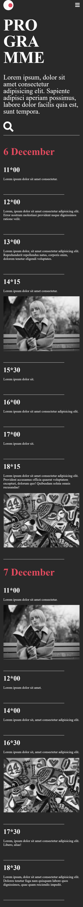
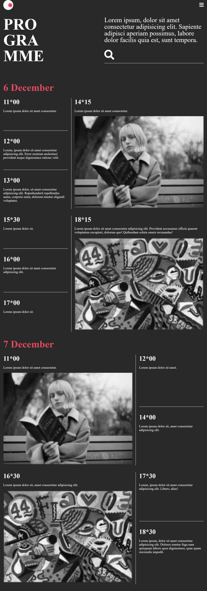
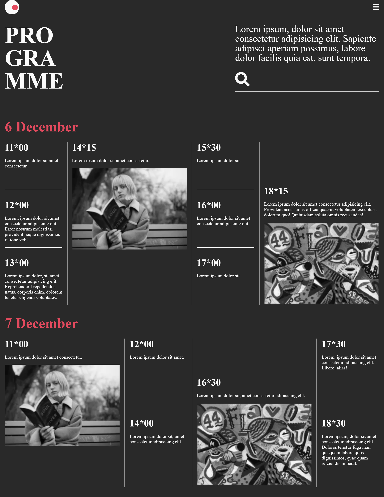

# -Ejercicio-de-Maquetaci-n-Responsive
Responsive layout exercise using css grid

## screenshot

## Developed for

[Platzi Master](https://platzi.com)

## Used tools

1. HTML5

2. CSS3

## credits

> Author mockup: [tubik](https://dribbble.com/Tubik).